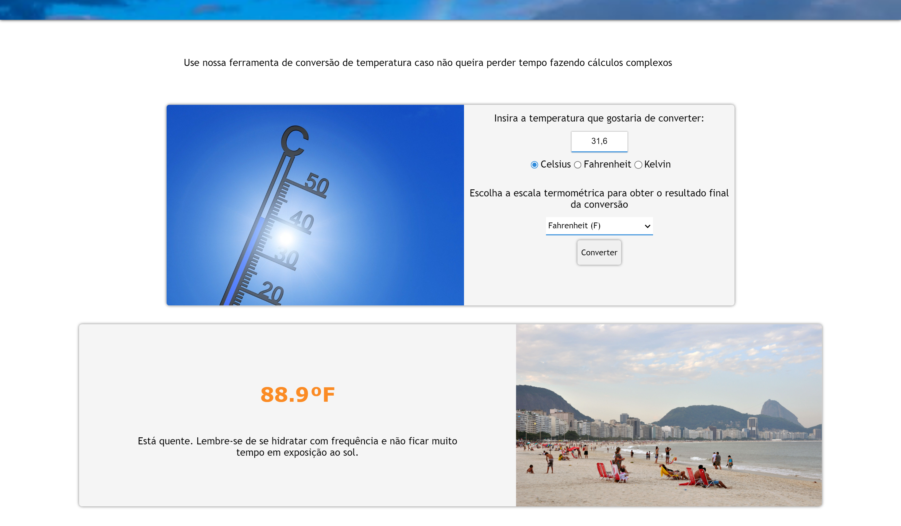

# Projeto Conversor de Escalas Termométricas
 Este projeto oferece ao usuário a possibilidade de converter uma temperatura de uma escala para outra.

## Linguagens
<ul>
    <li>HTML
    <li>CSS
    <li>JavaScript
</ul>

## Funcionalidades

Conversão para as escalas Celsius, Fahrenheit e Kelvin. Após inserida a temperatura e escolhidas as escalas, o código executa o cálculo e retorna, além do resultado, uma frase de efeito e uma imagem para ilustrar como o clima deve estar de acordo com a temperatura obtida.

### Links Externos

 Link do projeto: https://conversor-temperaturas-jricardo.netlify.app

 ## Visão da página durante demonstração:

 

 

 
